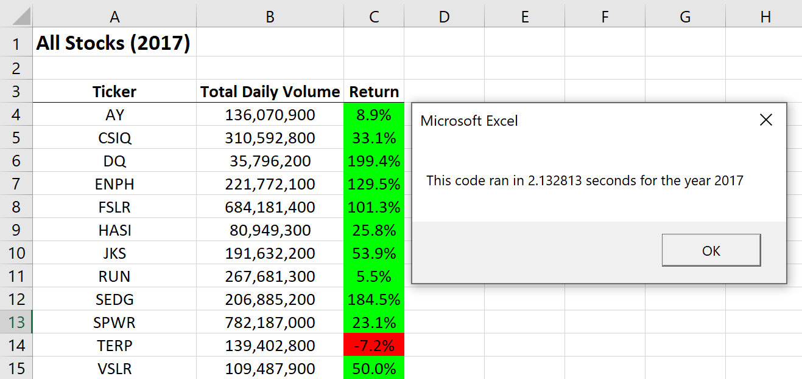

# **Stock Analysis**  


## **Overview of Project**
in this project we are helping a client to perform analysis on some stock data  


### **Purpose**
Our client wants to analyze the stock data of 12 companies in 2017 and 2018 to find how actively each company's stock was traded in these to years and to calculate yearly return of each companys stock  


## **Results**  

### **VBA code**
We have been provided with an excel file containing the information we need for the analysis. The data is stored in two sheets one for 2017 and another for 2018 here is what the data looks like  

  

We wrote a "VBA" code in order to analyze the data. to find how actively companies were trading stocks each year, we need to add up values for the number of stocks traded in each day (this is the value in olumn "H" of data sheets under the name: "Volume") for a particular Ticker during that year. Then to calculate yearly return for each Ticker we should identify the first closing price (at the begining of the year) and the last closing price (at the end of the year) of the stock (for each ticker) then we can calculate the yearly return using the formula below:  

Yearly Return = (last closing price / first closing price) - 1  

We have 12 tickers, this means that our code should go through the data find the information we need for each of these tickers, perform the desired operations, and output the result. To do so an array is defined in the code to store the name of these 12 tickers:  

```vb
    'Initialize array of all tickers
    Dim tickers(12) As String
    
    tickers(0) = "AY"
    tickers(1) = "CSIQ"
    tickers(2) = "DQ"
    tickers(3) = "ENPH"
    tickers(4) = "FSLR"
    tickers(5) = "HASI"
    tickers(6) = "JKS"
    tickers(7) = "RUN"
    tickers(8) = "SEDG"
    tickers(9) = "SPWR"
    tickers(10) = "TERP"
    tickers(11) = "VSLR"

```

Then we used nested loops and if statements to go through all the rows of the data sheet for each ticker in the array and pick the information we need from the cells if it belongs to that ticker and output the result in a new sheet we named "All Stocks Analysis", to make the code more flexible we deciced to take the desired year of the analysis from the user:  

```vb
yearValue = InputBox("What year would you like to run the analysis on?")
```


```vb
    rowstart = 2
    'rowEnd code taken from <a href="https://stackoverflow.com/questions/18088729/row-count-where-data-exists" stack</a> and finds the final row in the data sheet
    rowend = Cells(Rows.Count, "A").End(xlUp).Row
    
    'Loop through the tickers.
    
    For i = 0 To 11
        
        ticker = tickers(i)
        'set the initial value for the total volume of the current tecker to zero
        totalVolume = 0
    
        'Loop through rows in the data.
        Worksheets(yearValue).Activate
            
            For j = rowstart To rowend
                
                'Find the total volume for the current ticker.
                If Cells(j, 1).Value = ticker Then
                    totalVolume = totalVolume + Cells(j, 8).Value
                End If
                
                'Find the starting price for the current ticker.
                If Cells(j, 1).Value = ticker And Cells(j - 1, 1).Value <> ticker Then
                    startingPrice = Cells(j, 6).Value
                End If
                
                'Find the ending price for the current ticker.
                  If Cells(j, 1).Value = ticker And Cells(j + 1, 1).Value <> ticker Then
                    endingPrice = Cells(j, 6).Value
                End If
                
            Next j
            
        'Output the data for the current ticker .
    
        Worksheets("All Stocks Analysis").Activate
        Cells(4 + i, 1).Value = ticker
        Cells(4 + i, 2).Value = totalVolume
        Cells(4 + i, 3).Value = (endingPrice / startingPrice) - 1
        
    Next i
```
To evaluate the performance of the code we then added a few more lines to see how long the code takes to execute. For tha,t we used "Timer" function the code will record the timer's value once right after it takes the year from the user, assining it to a "startTime" variable and another time after it shows the result in the output sheet (after the "Next i" in the above code) and assigns it to an "endTime" variable then simply by subtracting "startTime" from "endTime" we will have the runtime of the code and we can show it in a message box:  

```vb
    Dim startTime As Single
    Dim endTime As Single
    

    yearValue = InputBox("What year would you like to run the analysis on?")
    
    startTime = Timer
```

```vb
    endTime = Timer
    MsgBox "This code ran in " & (endTime - startTime) & " seconds for the year " & (yearValue)

```
In the images below, we can see the results of running the cod for each year:  

<p float="left">
  
  
</p>

### **Refactoring the code**
After we were done with the code we decided to refator it in order to  make it run faster. to make that happen, we have to change the code to go through the whole data in the sheet just one time instead of once for each ticker (wich would be 12 times in our case).And within that loop we need to grab and store the relevant data we need for our analysis as code passes each row in the data so we would be able to go to the output sheet and show the result just once. with the aim of doing so we defined 3 more arrays to stor the data for ticker's volume, firs closing price and last closing price of the tickers wich are respectivedly: "tickerVolumes", "tickerStartingPrices" and "tickerEndingPrices", we also defined a counter variable "tickerIndex" to refer to the index of the elements in the arrays:

```vb
    'Create a ticker Index
    Dim tickerIndex As Integer
    
    'Create three output arrays
    Dim tickerVolumes(12) As Long
    Dim tickerStartingPrices(12) As Single
    Dim tickerEndingPrices(12) As Single
```
Then we initialized the array tickerVolumes" by setting the value of all of the elements inside it to zero:

```vb
    'Create a for loop to initialize the tickerVolumes to zero.
    For tickerIndex = 0 To 11
        tickerVolumes(tickerIndex) = 0
    Next tickerIndex
```

To go through the data just once we removed the first loop and in order to go to the next index in the array we used the counter variable "tickerIndex" and added 1 to it each time it gets to the end of one ticker data.Just remember we could do that because the data was sorted alphabetically just like how we put the data in "tickers" array.this way when in the data sheet we gets to the end of one ticker the next one automatically matches the next element in the array.  

Before entering the loop that goes through te data we need to reset the value of the counter variable to zero as its going to be equal to 11 at the end of the loop above. here is the code:

```vb
    'set the tickerIndex equal to zero
    tickerIndex = 0
    
    'Loop over all the rows in the spreadsheet.
        For i = 2 To RowCount
                ticker = tickers(tickerIndex)
        'Increase volume for current ticker
                tickerVolumes(tickerIndex) = tickerVolumes(tickerIndex) + Cells(i, 8).Value

        
        'Check if the current row is the first row with the selected tickerIndex.
        
        
            If Cells(i, 1).Value = ticker And Cells(i - 1, 1).Value <> ticker Then
                tickerStartingPrices(tickerIndex) = Cells(i, 6).Value
            End If
                
       
        
        'check if the current row is the last row with the selected ticker
         'If the next rowÕs ticker doesnÕt match, increase the tickerIndex.
        
              If Cells(i, 1).Value = ticker And Cells(i + 1, 1).Value <> ticker Then
                tickerEndingPrices(tickerIndex) = Cells(i, 6).Value
                
                'Increase the tickerIndex.
                tickerIndex = tickerIndex + 1
            End If
            
    
    Next i
```
After this loop we defined another loop that goes to the output sheet and places the results where we want to